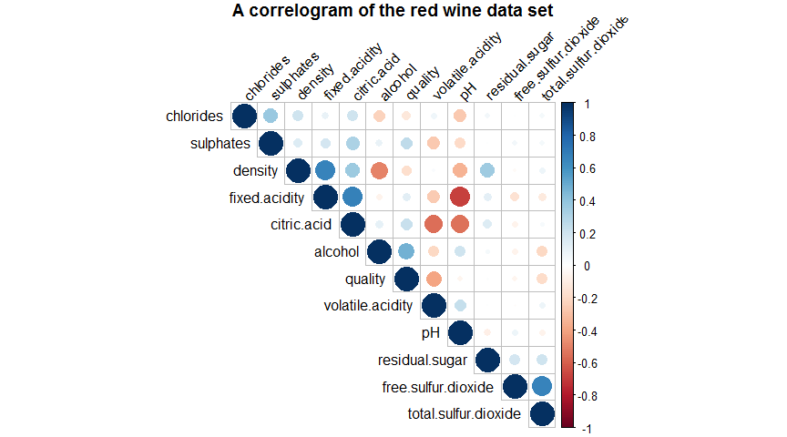
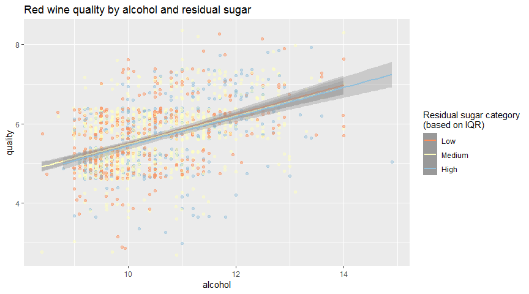
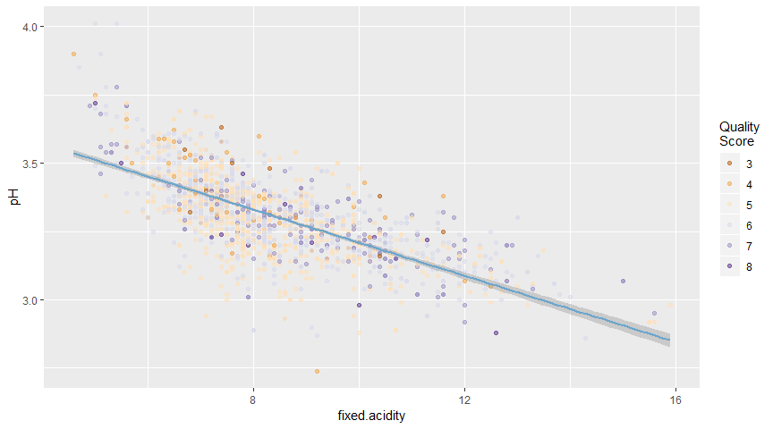
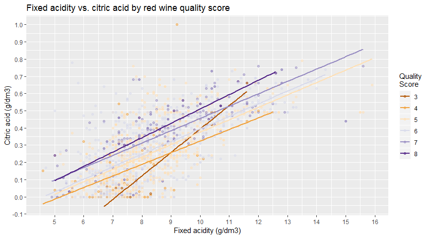

------------------------------------------------------------------------

Which chemical properties influence the quality of red wines?
-------------------------------------------------------------

### Introduction into the dataset

This tidy data set contains 1,599 red wines with 11 variables on the chemical properties of the wine. At least 3 wine experts rated the quality of each wine, providing a rating between 0 (very bad) and 10 (very excellent).

### Preliminary exploration of the dataset & some summaries of the data

Check the dataset for nulls & duplicates:

    ## [1] FALSE

    ## [1] 0

------------------------------------------------------------------------

Dimension of a data frame:

    ## [1] 1599   13

------------------------------------------------------------------------

First few rows of a data frame:

    ##   X fixed.acidity volatile.acidity citric.acid residual.sugar chlorides
    ## 1 1           7.4             0.70        0.00            1.9     0.076
    ## 2 2           7.8             0.88        0.00            2.6     0.098
    ## 3 3           7.8             0.76        0.04            2.3     0.092
    ## 4 4          11.2             0.28        0.56            1.9     0.075
    ## 5 5           7.4             0.70        0.00            1.9     0.076
    ## 6 6           7.4             0.66        0.00            1.8     0.075
    ##   free.sulfur.dioxide total.sulfur.dioxide density   pH sulphates alcohol
    ## 1                  11                   34  0.9978 3.51      0.56     9.4
    ## 2                  25                   67  0.9968 3.20      0.68     9.8
    ## 3                  15                   54  0.9970 3.26      0.65     9.8
    ## 4                  17                   60  0.9980 3.16      0.58     9.8
    ## 5                  11                   34  0.9978 3.51      0.56     9.4
    ## 6                  13                   40  0.9978 3.51      0.56     9.4
    ##   quality
    ## 1       5
    ## 2       5
    ## 3       5
    ## 4       6
    ## 5       5
    ## 6       5

------------------------------------------------------------------------

Summary of descriptive statistics:

    ##        X          fixed.acidity   volatile.acidity  citric.acid   
    ##  Min.   :   1.0   Min.   : 4.60   Min.   :0.1200   Min.   :0.000  
    ##  1st Qu.: 400.5   1st Qu.: 7.10   1st Qu.:0.3900   1st Qu.:0.090  
    ##  Median : 800.0   Median : 7.90   Median :0.5200   Median :0.260  
    ##  Mean   : 800.0   Mean   : 8.32   Mean   :0.5278   Mean   :0.271  
    ##  3rd Qu.:1199.5   3rd Qu.: 9.20   3rd Qu.:0.6400   3rd Qu.:0.420  
    ##  Max.   :1599.0   Max.   :15.90   Max.   :1.5800   Max.   :1.000  
    ##  residual.sugar     chlorides       free.sulfur.dioxide
    ##  Min.   : 0.900   Min.   :0.01200   Min.   : 1.00      
    ##  1st Qu.: 1.900   1st Qu.:0.07000   1st Qu.: 7.00      
    ##  Median : 2.200   Median :0.07900   Median :14.00      
    ##  Mean   : 2.539   Mean   :0.08747   Mean   :15.87      
    ##  3rd Qu.: 2.600   3rd Qu.:0.09000   3rd Qu.:21.00      
    ##  Max.   :15.500   Max.   :0.61100   Max.   :72.00      
    ##  total.sulfur.dioxide    density             pH          sulphates     
    ##  Min.   :  6.00       Min.   :0.9901   Min.   :2.740   Min.   :0.3300  
    ##  1st Qu.: 22.00       1st Qu.:0.9956   1st Qu.:3.210   1st Qu.:0.5500  
    ##  Median : 38.00       Median :0.9968   Median :3.310   Median :0.6200  
    ##  Mean   : 46.47       Mean   :0.9967   Mean   :3.311   Mean   :0.6581  
    ##  3rd Qu.: 62.00       3rd Qu.:0.9978   3rd Qu.:3.400   3rd Qu.:0.7300  
    ##  Max.   :289.00       Max.   :1.0037   Max.   :4.010   Max.   :2.0000  
    ##     alcohol         quality     
    ##  Min.   : 8.40   Min.   :3.000  
    ##  1st Qu.: 9.50   1st Qu.:5.000  
    ##  Median :10.20   Median :6.000  
    ##  Mean   :10.42   Mean   :5.636  
    ##  3rd Qu.:11.10   3rd Qu.:6.000  
    ##  Max.   :14.90   Max.   :8.000

------------------------------------------------------------------------

Univariate Plots
================

Our output variable is wine quality, so let's see how the histogram of quality looks:  

We don't have any wine samples with a quality score below 3 or above 8. Most of the red wines have quality score of 5 and 6.

------------------------------------------------------------------------

Acidity related variables:  

Fixed acidity distribution is skewed right (positive) and most of the values are between 7 and 9, with a median (from the earlier summary) of 7.90 g/dm³ and a mean of 8.32 g/dm³.

Volatile acidity distribution also looks somewhat positively skewed, but if we get rid of the outliers, we could consider it bimodal with 2 peaks at 0.4 and 0.6 g/dm³. Our median and mean are very close, with a median of 0.52 g/dm³, and mean of 0.5278 g/dm³, which confirms that the distribution is rather bimodal or normal than skewed right.

The citric acid distribution is uniform with a slight positive skewness. There are over 200 wines with a zero citric acid, which makes over 13% of our data. We have a mean of 0.271 g/dm³ and a median of 0.260 g/dm³ here.

------------------------------------------------------------------------

Sugar & salt:  

We see quite a lot of outliers for sugar & salt (residual.sugar and chlorides). One way to fix it would be cutting them off based on a 95% of the observations: 

Now it looks better. Residual sugar distribution is right skewed with most values between 1.90 and 2.60 (from the earlier summary and the histogram).

Updated chlorides distribution looks somewhat normal with a few unusual data points near zero. Most of the values are located between 0.07 and 0.09.

------------------------------------------------------------------------

Remaining variables:  

Here, we see a similar right skewed distribution shapes for free sulfur dioxide and total sulfur dioxide, which makes sense, because these are closely related variables.

Density and pH both look normally distributed. These are not directly related to each other, so we assume they are independently normally distributed (unlike sulfur dioxides).

We can see some outlier values for the sulphates distribution, with most values being between 0.55 and 0.73 (from the earlier summary and the histogram).

Alcohol is kind of right skewed with most values between 9.50 and 11.10. The alcohol mean is 10.42% (% by volume).

------------------------------------------------------------------------

Univariate Analysis
===================

### The structure of our dataset

Our data set consists of 12 variables, with 1599 observations. 

Attribute information:⁽¹⁾ 

Input variables (based on physicochemical tests):   1 - fixed acidity (tartaric acid - g / dm³)   2 - volatile acidity (acetic acid - g / dm³)   3 - citric acid (g / dm³)   4 - residual sugar (g / dm³)   5 - chlorides (sodium chloride - g / dm³   6 - free sulfur dioxide (mg / dm³)   7 - total sulfur dioxide (mg / dm³)   8 - density (g / cm³)   9 - pH 10 - sulphates (potassium sulphate - g / dm³)   11 - alcohol (% by volume)  

Output variable (based on sensory data):   12 - quality (score between 0 and 10)  

### Main features of interest in our dataset

Do wines with higher alcoholic content receive better ratings? Do sweeter wines receive higher ratings?

### Other features in the dataset we think will help support our
investigation into our features of interest?

What level of acidity receives the highest average rating? What other variables could be connected with predicting the wine quality?

### Of the features we investigated, were there any unusual distributions?
Did we perform any operations on the data to tidy, adjust, or change the form
of the data? If so, why did we do this?

Most of the distributions are either right skewed or normal with some of them having a few outliers (like residual sugar and chlorides).

We did check the data set for null values and duplicates. No nulls or duplicates were discovered, data is easy to manipulate, model and visualize.

Bivariate Plots Section
=======================

Let's start with a correlogram:

Interpretation: positive correlations are displayed in blue and negative correlations in red color. Color intensity and the size of the circle are proportional to the correlation coefficients.

Our output variable is quality, so first let's take a closer look at it. Our biggest circles would be quality vs. alcohol and quality vs. volatile acidity. We will note these two variables for a further investigation.

Next, let's note other significant correlations (big circles on our correlogram). We have density vs. fixed acidity, fixed acidity vs. citric acid, fixed acidity vs. pH, free sulfur dioxide vs. total sulfur dioxide. Let's draw some scatter plots to observe what is going on.

------------------------------------------------------------------------

A closer look at variables that showed a stronger correlation in a correlogram: 

We see a negative relationship between fixed acidity and pH. As the x-values increase (fixed acidity) the y-values tend to decrease (pH). This makes perfect sense, because these variables are related. pH is used to specify the acidity - the lower pH, the more acid in a solution.

Next, we can see a positive relationship between fixed acidity and citric acid. Again, this makes sense, because these variables are related. After doing some research online, we can confirm that traditionally total acidity is divided into two groups, namely the volatile acids and the nonvolatile or fixed acids. The predominant fixed acids found in wines are tartaric, malic, citric, and succinic⁽²⁾.

  Image source: <https://commons.wikimedia.org/> (Mariana Ruiz Villarreal)   

There is a positive relationship between density and fixed acidity. It's not obvious to say that these are chemically connected, but we would assume that (further research is needed to confirm).

On the last scatter plot on our graph, free sulfur dioxide vs. total sulfur dioxide, we also see a positive relationship, which can be explained by the fact that total sulfur dioxide actually contains free sulfur dioxide, so it is not unusual to observe a linear relationship here.

------------------------------------------------------------------------

Initially, we were interested how alcohol, sugar and acidity (pH) affect the quality of wine. We also found out that there could be a weak correlation between volatile acidity and quality (from our correlogram above).

Scatter plot of matrices for a choice of variables that we are now interested in: 

Correlation coefficient interpretation:

-   1 (-1) - Perfect linear relationship
-   0.70 (-0.70) - Strong linear relationship
-   0.50 (-0.50) - Moderate relationship
-   0.30 (-0.30) - Weak linear relationship
-   0 - No linear relationship

From this graph, quality vs. alcohol and quality vs. volatile acidity show the strongest correlation.

Quality vs. alcohol shows a weak/moderate positive relationship, while quality vs. volatile acidity shows a weak negative relationship.

------------------------------------------------------------------------

We need to remember that we had some outliers for sugar (toward the right tail of the distribution), so let's take a look at a 95% of the observations in a boxplot, just to confirm once again that we have no linear relationship here: 

Bivariate Analysis
==================

### Some of the relationships we observed in this part of the
investigation. How did the features of interest vary with other features in
the data set?

We observed some strong relationships between the chemically connected variables, such as fixed acidity vs. citric acid, fixed acidity vs. pH, free sulfur dioxide vs. total sulfur dioxide.

As for the main features of interest, we didn't see a direct linear relationship between sugar and red wine quality, but we will further investigate alcohol (weak/moderate positive relationship).

### Did we observe any interesting relationships between the other features
(not the main features of interest)?

We will take a closer look on volatile acidity (weak negative relationship with the red wine quality according to the correlation coefficient) and pH (no relationship so far).

### What was the strongest relationship you found?

In terms of wine quality, strongest relationship is between quality score and alcohol (correlation coefficient of 0.48).

Multivariate Plots Section
==========================

Do wines with higher alcoholic content receive better ratings? Do sweeter wines receive higher ratings? What level of acidity receives the highest average rating?

------------------------------------------------------------------------

Let's create new categorical variable for sugar, based on a summary analysis from part 1 (IQR).

    ##    Min. 1st Qu.  Median    Mean 3rd Qu.    Max. 
    ##   0.900   1.900   2.200   2.539   2.600  15.500

    ## 
    ##    Low Medium   High 
    ##    464    780    355

------------------------------------------------------------------------

While there is a relationship between alcohol and quality, we don't observe any noticeable trends for the residual sugar.

------------------------------------------------------------------------

Now, let's create new categorical variable for the level of acidity, also on a summary analysis from part 1 (IQR).

    ##    Min. 1st Qu.  Median    Mean 3rd Qu.    Max. 
    ##   2.740   3.210   3.310   3.311   3.400   4.010

    ## 
    ## pH > 2.74 pH > 3.21 pH > 3.40 
    ##       424       788       387

------------------------------------------------------------------------

From the graph above, there's a slight evidence that higher pH levels (pH &gt; 3.40, less acidic wines) could be associated with a lower wine quality.

We also see that higher pH levels (less acid) are more common for high alcohol wines.

------------------------------------------------------------------------

Now, let's have a look at pH level and volatile acidity.

In this graph, we observe the three pH categories that we created earlier by alcohol vs. quality vs. volatile acidity. On the left we see all the red wines with pH values pH &lt;= Q1 (25th percentile), on the middle - the interquartile range of pH values and on the right wines with pH &gt; Q3 (75th percentile). It makes sense that we see most data points in the middle part, because 50% of our data is there.

The three scatter plots look similar in shape. Once again, we see that higher pH levels could be more common for high alcohol wines, but there is no strong evidence to support that.

As for the volatile acidity, we could say we have higher volatile acidity samples at the bottom (worse wine quality) and lower volatile acidity samples at the top of the graph (better wine quality), which corresponds to the negative correlation we found out earlier.

------------------------------------------------------------------------

On a scatter plot of red wine quality by volatile acidity and pH level, we kind of observe that higher pH levels (pH &gt; 3.21) could be associated with higher volatile acidity levels, which goes against the intuition, because higher pH means less acid. If we get back to our scatter plot of matrices, the correlation coefficient for volatile acidity vs. pH is 0.23, which confirms that if there is a linear relationship between these two, it's rather positive. In general, we don't think 0.23 is significant enough to make any conclusions here.

We do see the weak negative relationship between red wine quality and volatile acidity.

------------------------------------------------------------------------

Let's also improve the plots we created earlier in part 2 by adding the quality variable to them:

We don't see any strong observable wine quality patterns here for fixed acidity vs. pH or free sulfur dioxide vs. total sulfur dioxide.

------------------------------------------------------------------------

As for the density vs. fixed acidity and fixed acidity vs. citric acid, we do see some patterns for a further investigation.

In density vs. fixed acidity, we can see a slight negative relationship between density and wine quality: with density decreasing, quality score could increase.

In fixed acidity vs. citric acid, higher quality wine samples are located at the top, which means that there could be a weak positive relationship between citric acid and quality (with citric acid increasing, quality also increases).

The relationships in our data set are not always strongly linear (except for some variables that are co-dependent), so we don't want to overload our prediction model with a lot of variables (it will make the model weaker). Let's check which variable has stronger correlation coefficient - density or citric acid:

    ## 
    ##  Pearson's product-moment correlation
    ## 
    ## data:  redwine$density and redwine$quality
    ## t = -7.0997, df = 1597, p-value = 1.875e-12
    ## alternative hypothesis: true correlation is not equal to 0
    ## 95 percent confidence interval:
    ##  -0.2220365 -0.1269870
    ## sample estimates:
    ##        cor 
    ## -0.1749192

    ## 
    ##  Pearson's product-moment correlation
    ## 
    ## data:  redwine$citric.acid and redwine$quality
    ## t = 9.2875, df = 1597, p-value < 2.2e-16
    ## alternative hypothesis: true correlation is not equal to 0
    ## 95 percent confidence interval:
    ##  0.1793415 0.2723711
    ## sample estimates:
    ##       cor 
    ## 0.2263725

Based on these results, we will continue working with the citric acid variable (correlation coefficient of 0.23 versus -0.17 for the density):

------------------------------------------------------------------------

### Building a red wine quality prediction model based on our observations

Let's try to build a prediction model based on the discovered relationships between our variables.

    ## 
    ## Calls:
    ## m1: lm(formula = (quality ~ alcohol), data = redwine)
    ## m2: lm(formula = quality ~ alcohol + volatile.acidity, data = redwine)
    ## m3: lm(formula = quality ~ alcohol + volatile.acidity + citric.acid, 
    ##     data = redwine)
    ## 
    ## ==============================================================
    ##                          m1            m2            m3       
    ## --------------------------------------------------------------
    ##   (Intercept)           1.875***      3.095***      3.055***  
    ##                        (0.175)       (0.184)       (0.194)    
    ##   alcohol               0.361***      0.314***      0.314***  
    ##                        (0.017)       (0.016)       (0.016)    
    ##   volatile.acidity                   -1.384***     -1.343***  
    ##                                      (0.095)       (0.114)    
    ##   citric.acid                                       0.068     
    ##                                                    (0.103)    
    ## --------------------------------------------------------------
    ##   R-squared             0.227         0.317         0.317     
    ##   adj. R-squared        0.226         0.316         0.316     
    ##   sigma                 0.710         0.668         0.668     
    ##   F                   468.267       370.379       246.976     
    ##   p                     0.000         0.000         0.000     
    ##   Log-likelihood    -1721.057     -1621.814     -1621.596     
    ##   Deviance            805.870       711.796       711.603     
    ##   AIC                3448.114      3251.628      3253.192     
    ##   BIC                3464.245      3273.136      3280.078     
    ##   N                  1599          1599          1599         
    ## ==============================================================

Interpretation: R-squared defines the practical value of correlations on a percent scale from 0 to 100. A predictor that has a low p-value is likely to be a meaningful addition to our model because changes in the predictor's value are related to changes in the response variable.

In our model, there are no problems with the p-values, but the R-squared values are quote low, which could mean that the practical value of this particular model is low. The variables in this linear model can account for 31.7% of the variance in the quality of red wines.

------------------------------------------------------------------------

Let's predict a quality of wine based on our model and a sample of "Red Wine Pau Penedés 2017".

  Image source: <https://ilusionmas.com>   

This wine sample has the following attributes⁽³⁾:

Alcoholic degree: 13.5%  Total acidity: 5.6g/l  Volatile acidity: 0.40g/l  Reduce sugar: 1.5g/l  Sulfur dioxide free: 25mg/l  Sulfur dioxide total: 52mg/l  pH: 3.25 

citric acid = N/A 

Note that for this particular sample we don't have any data on citric acid measurement, so we will replace it with the mean value from our dataset.

    ##        fit      lwr      upr
    ## 1 6.773348 5.459294 8.087401

Interpretation: fit = the predicted value / lwr and upr = the lower and the upper confidence limits for the expected value.

**Based on our model, the predicted value of red wine "Pau Penedés 2017", is 7 (rounded score). This wine will likely receive a quality score between 5 and 8 with a confidence level of 95% (limitations apply).**

------------------------------------------------------------------------

Multivariate Analysis
=====================

### Did we create any new variables from existing variables in the dataset?

In this last part, we created three new categories for sugar ("Low", "Medium", "High"), as well as three new categories (or buckets) for the pH level ("pH &gt; 2.74", "pH &gt; 3.21", "pH &gt; 3.40"). In both cases, data was split according to IQR levels (below IQR, IQR, above IQR).

### Let's talk about some of the relationships we observed in this part of the
investigation. Were there features that strengthened each other in terms of
looking at our features of interest?

While there is a relationship between alcohol and quality, we don’t observe any noticeable trends for the residual sugar.

There’s a slight evidence that higher pH levels (pH &gt; 3.40) could be associated with a lower wine quality. We also see that higher pH levels are more common for high alcohol wines.

There could be a weak negative relationship between red wine quality and volatile acidity.

In addition, there could be a slight negative relationship between density and wine quality, as well as a weak positive relationship between citric acid and quality (with citric acid increasing, quality also increases).

### Were there any interesting or surprising interactions between features?

We observed that higher pH levels (pH &gt; 3.21) could be associated with higher volatile acidity levels, which goes against the intuition, because higher pH means less acid. The correlation coefficient for volatile acidity vs. pH is 0.23, which confirms that if there is a linear relationship between these two, it’s rather positive. In general, we don’t think 0.23 is significant enough to make any conclusions here.

### Did we create any models with our dataset? Let's discuss the
strengths and limitations of our model.

We tried to build the prediction model based on the relationship between variables. We did test our model on a real random sample of red wine, but we have to remember that the variables in this linear model can account for only 31.7% of the variance in the quality of red wines.

The limitations of our model include lacking of strong linear relationships between variables, insufficient data and sensitivity to outliers.

------------------------------------------------------------------------

Final Plots and Summary
=======================

### Plot One

### Description One

We didn't observe any noticeable relationships between sugar and wine quality, so we can't confirm that sweeter wines receive higher (or lower) ratings from the given data.

------------------------------------------------------------------------

### Plot Two

### Description Two

There’s a slight evidence that higher pH levels (pH &gt; 3.40, less acidic wines) could be associated with a lower wine quality. We also see that higher pH levels (less acid) are more common for high alcohol wines.

------------------------------------------------------------------------

### Plot Three

### Description Three

Higher quality wine samples are located at the top, which means that there could be a weak positive relationship between citric acid and quality (with citric acid increasing, quality also increases). After checking the Pearson's product-moment correlation, there is a very weak positive relationship between these two variables.

------------------------------------------------------------------------

Reflection
==========

The tidy red wine data set contains 1,599 red wines. We didn't initially know which variables could affect the quality of wine, so intuitively we started with the following questions:

Do wines with higher alcoholic content receive better ratings?  Do sweeter wines receive higher ratings?  Additionally, what level of acidity receives the highest average rating?

We started with observing the histogram of each of 12 variables to understand how the data is distributed. Then, we looked at the relationships between a main output feature and the supporting variables. We observed some relationships between supporting variables as well. Finally, we created a few multivariate plots to investigate more complex interactions between variables, based on what we found in the bivariate plots section.

After observing the interactions between our variables, we chose which variables to include in the final linear prediction model. We built a model based on 3 final variables and tested it on a real red wine sample data that we took from some online shop. The final model is quote weak, with an account for only 31.7% of the variance in the quality of red wines, but it is worth mentioning that in data analysis, we often need to work with a data that is not perfect.

For the future work with the data set, we suggest the following:

1.  Improve nonlinear relationships with transforming some of the parameters with a log, square root, etc. transformations. 
2.  Add more wines into the data set to build a better model. For example, use white wine data set from the same authors. It has 4898 wine samples and the same chemical attribute variables.

Finally, our answers to the initial questions are following:

Do wines with higher alcoholic content receive better ratings? **Yes, we do believe that wines with higher alcoholic content could receive better ratings.**  Do sweeter wines receive higher ratings? **No, we can't confirm this. We didn't observe any relationships between sugar and wine quality.**  Additionally, what level of acidity receives the highest average rating? **There’s a slight evidence that higher pH levels (pH &gt; 3.40, less acidic wines) could be associated with a lower wine quality.**

------------------------------------------------------------------------

#### References

\[1\] P. Cortez, A. Cerdeira, F. Almeida, T. Matos and J. Reis. Modeling wine preferences by data mining from physicochemical properties. In Decision Support Systems, Elsevier, 47(4):547-553. ISSN: 0167-9236.  \[2\] Nierman, D. (2004). Fixed Acidity. \[online\] Available at: <http://waterhouse.ucdavis.edu/whats-in-wine/fixed-acidity> \[Accessed 07 Jan. 2019\].  \[3\] Ilusion+. (2018). Red Wine Pau Penedés 2017. \[online\] Available at: <http://ilusionmas.com/en/producto/vino-penedes/> \[Accessed 07 Jan. 2019\].
